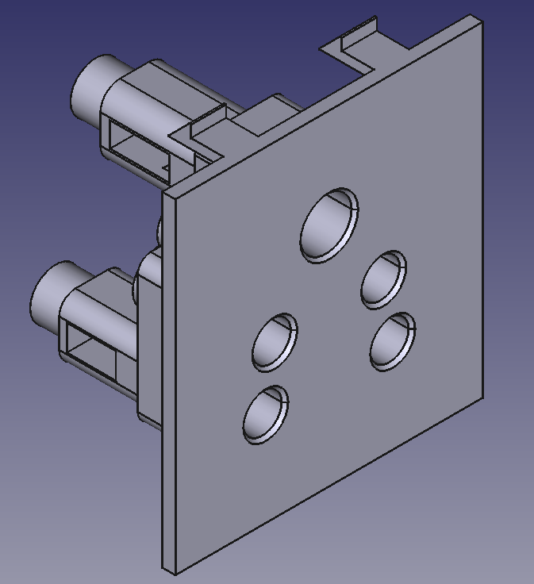
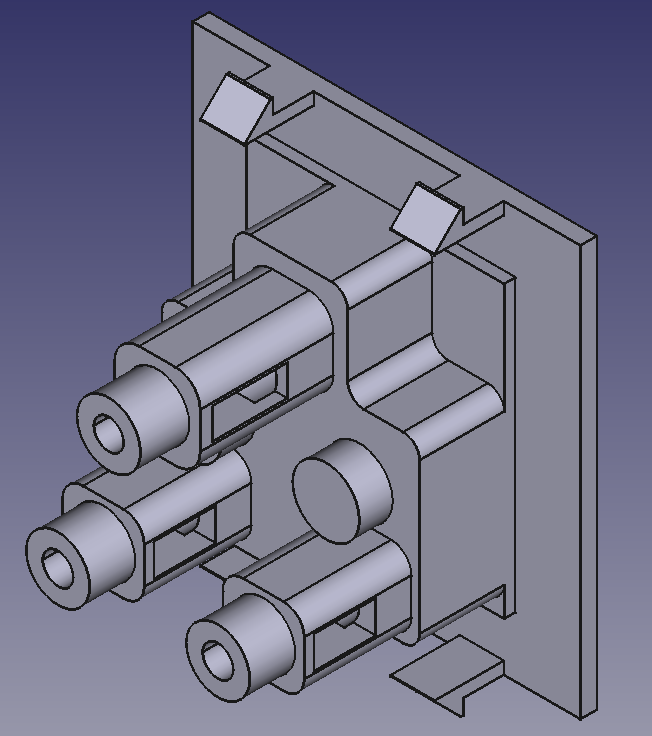

# Indian-Modular-Standard

Reverse-engineered mechanical CAD and dimensioned drawings for Indian modular electrical switch systems, including snap-fit geometry, frame interface dimensions, and module standards.
I shall add different components as I go, along with their engineering drawings and screenshots.

## RANT

### I absolutely cannot believe information on this is so insanely scarce. Such modular electrical sockets, boxes etc etc are ubiquitous across the country, yet I could not find a single dimensional drawing of a socket or dimensions to comply with the snap fit mechanism. I was planning on making some HomeAssistant compatible hardware for my house and couldn't find ANYTHING about the dimensions etc.

# Images

## 6A 2 position socket

